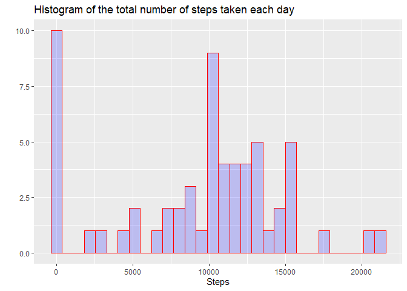
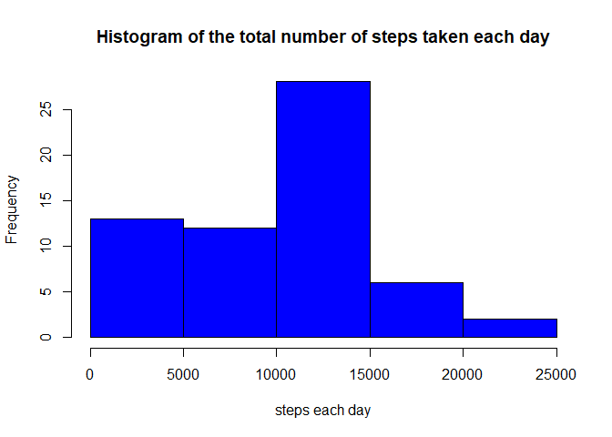
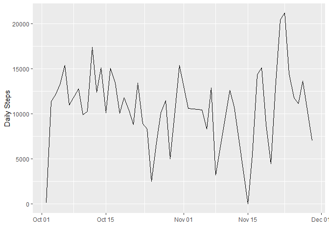
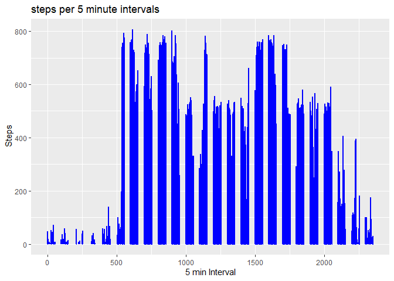
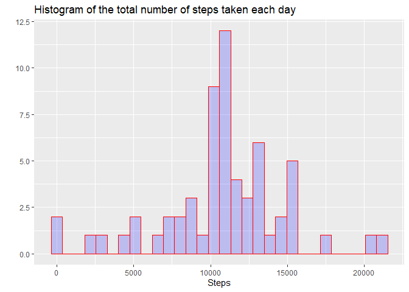
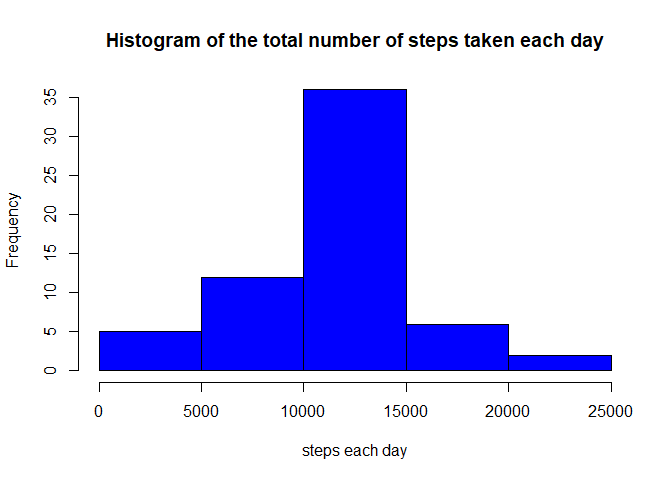
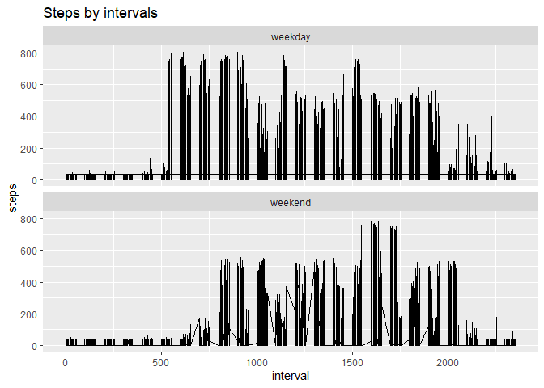

variables included in this dataset are:

steps: Number of steps taking in a 5-minute interval (missing values are coded as NA)
date: The date on which the measurement was taken in YYYY-MM-DD format
interval: Identifier for the 5-minute interval in which measurement was taken

Download & unzip dataset 
read dataset Process/transform the data 
(if necessary) into a format suitable for your analysis


```r
library(ggplot2)
library(lubridate)
```

```
## 
## Attaching package: 'lubridate'
```

```
## The following object is masked from 'package:base':
## 
##     date
```

```r
temp <- tempfile()
download.file("https://d396qusza40orc.cloudfront.net/repdata%2Fdata%2Factivity.zip",temp)
unzip(temp)
```

read dataset Process/transform the data 
(if necessary) into a format suitable for your analysis


```r
activityRR<- read.csv("activity.csv")
summary(activityRR)
```

```
##      steps                date          interval     
##  Min.   :  0.00   2012-10-01:  288   Min.   :   0.0  
##  1st Qu.:  0.00   2012-10-02:  288   1st Qu.: 588.8  
##  Median :  0.00   2012-10-03:  288   Median :1177.5  
##  Mean   : 37.38   2012-10-04:  288   Mean   :1177.5  
##  3rd Qu.: 12.00   2012-10-05:  288   3rd Qu.:1766.2  
##  Max.   :806.00   2012-10-06:  288   Max.   :2355.0  
##  NA's   :2304     (Other)   :15840
```

```r
activityRR$date<-ymd(activityRR$date)
summary(activityRR)
```

```
##      steps             date               interval     
##  Min.   :  0.00   Min.   :2012-10-01   Min.   :   0.0  
##  1st Qu.:  0.00   1st Qu.:2012-10-16   1st Qu.: 588.8  
##  Median :  0.00   Median :2012-10-31   Median :1177.5  
##  Mean   : 37.38   Mean   :2012-10-31   Mean   :1177.5  
##  3rd Qu.: 12.00   3rd Qu.:2012-11-15   3rd Qu.:1766.2  
##  Max.   :806.00   Max.   :2012-11-30   Max.   :2355.0  
##  NA's   :2304
```

```r
head(activityRR)
```

```
##   steps       date interval
## 1    NA 2012-10-01        0
## 2    NA 2012-10-01        5
## 3    NA 2012-10-01       10
## 4    NA 2012-10-01       15
## 5    NA 2012-10-01       20
## 6    NA 2012-10-01       25
```

Histogram of the total number of steps taken each day


```r
stepseachDay <- tapply(activityRR$steps, activityRR$date, sum, na.rm=TRUE)

qplot(stepseachDay,
      geom="histogram",
      main = "Histogram of the total number of steps taken each day", 
      xlab = "Steps",  
      fill=I("blue"), 
      col=I("red"), 
      alpha=I(.2))
```

```
## `stat_bin()` using `bins = 30`. Pick better value with `binwidth`.
```

<!-- -->

```r
hist(stepseachDay,col = "blue", main="Histogram of the total number of steps taken each day", xlab= "steps each day")
```

<!-- -->

Mean and median number of steps taken each day


```r
summary(stepseachDay)
```

```
##    Min. 1st Qu.  Median    Mean 3rd Qu.    Max. 
##       0    6778   10395    9354   12811   21194
```

```r
mean<-mean(stepseachDay)
median(stepseachDay)
```

```
## [1] 10395
```

Time series plot of the average number of steps taken had to make a new matrix as the old one was not labled columns


```r
totalstepsperday <- aggregate(steps ~ date, data = activityRR, FUN = sum, na.rm = TRUE)
head(totalstepsperday)
```

```
##         date steps
## 1 2012-10-02   126
## 2 2012-10-03 11352
## 3 2012-10-04 12116
## 4 2012-10-05 13294
## 5 2012-10-06 15420
## 6 2012-10-07 11015
```

```r
summary(totalstepsperday)
```

```
##       date                steps      
##  Min.   :2012-10-02   Min.   :   41  
##  1st Qu.:2012-10-16   1st Qu.: 8841  
##  Median :2012-10-29   Median :10765  
##  Mean   :2012-10-30   Mean   :10766  
##  3rd Qu.:2012-11-16   3rd Qu.:13294  
##  Max.   :2012-11-29   Max.   :21194
```

```r
ggplot(totalstepsperday, aes(date, steps)) + geom_line() +
  xlab("") + ylab("Daily Steps")
```

<!-- -->

The 5-minute interval that, on average, contains the maximum number of steps
The origional dataframe has 5 the steps measured in 5 minutes intervals per day.


```r
ggplot(activityRR, aes(x = interval , y = steps))+
  geom_line(color="blue", size=1) + 
  labs(title = "steps per 5 minute intervals", x = "5 min Interval", y = " Steps")
```

```
## Warning: Removed 2 rows containing missing values (geom_path).
```

<!-- -->

```r
summary(activityRR)
```

```
##      steps             date               interval     
##  Min.   :  0.00   Min.   :2012-10-01   Min.   :   0.0  
##  1st Qu.:  0.00   1st Qu.:2012-10-16   1st Qu.: 588.8  
##  Median :  0.00   Median :2012-10-31   Median :1177.5  
##  Mean   : 37.38   Mean   :2012-10-31   Mean   :1177.5  
##  3rd Qu.: 12.00   3rd Qu.:2012-11-15   3rd Qu.:1766.2  
##  Max.   :806.00   Max.   :2012-11-30   Max.   :2355.0  
##  NA's   :2304
```
We find out what the maximum amount of steps is by the function below which confirms with the summary chart above.


```r
max_step<- max(activityRR$steps, na.rm=T)
max_step
```

```
## [1] 806
```

Then we place this in the datafram to find out which 5 minute interval contains that maximum number of steps and we find

```r
activityRR[max_step, ]$interval
```

```
## [1] 1905
```

Code to describe and show a strategy for imputing missing data
replacing missing values with the mean


```r
activityRR$steps[is.na(activityRR$steps)]<-mean(activityRR$steps, na.rm=TRUE)
```
Histogram of the total number of steps taken each day after missing values are imputed


```r
stepseachDay <- tapply(activityRR$steps, activityRR$date, sum, na.rm=TRUE)

qplot(stepseachDay,
      geom="histogram",
      main = "Histogram of the total number of steps taken each day", 
      xlab = "Steps",  
      fill=I("blue"), 
      col=I("red"), 
      alpha=I(.2))
```

```
## `stat_bin()` using `bins = 30`. Pick better value with `binwidth`.
```

<!-- -->

```r
hist(stepseachDay,col = "blue", main="Histogram of the total number of steps taken each day", xlab= "steps each day")
```

<!-- -->

Panel plot comparing the average number of steps taken per 5-minute interval across weekdays and weekends

find the days by the date

```r
activityRR$days<-weekdays(as.Date(activityRR$date))
```
Make a new column decerning between weekdays and weekends


```r
activityRR$wDay  <- ifelse(weekdays(activityRR$date) %in% c("Saturday", "Sunday"), "weekend", "weekday")
```
Panel plot comparing the average number of steps taken per 5-minute interval across weekdays and weekends


```r
ggplot(activityRR , aes(x = interval , y = steps)) +
  geom_line() +
  labs(title = "Steps by intervals", x = "interval", y = "steps") +
  facet_wrap(~wDay , ncol = 1, nrow=2)
```

<!-- -->
All of the R code needed to reproduce the results (numbers, plots, etc.) in the report is above


